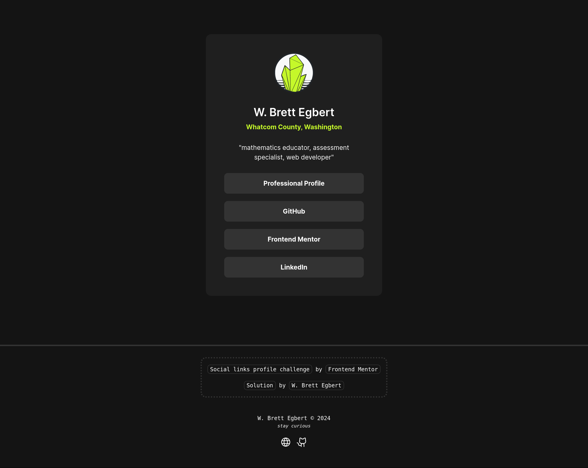

# Social links profile | Frontend Mentor Challenge

## Table of Contents

- [Social links profile | Frontend Mentor Challenge](#social-links-profile--frontend-mentor-challenge)
  - [Table of Contents](#table-of-contents)
  - [Overview](#overview)
    - [About](#about)
    - [Screenshots](#screenshots)
      - [Desktop](#desktop)
      - [Mobile](#mobile)
    - [Links](#links)
    - [Core Functionality](#core-functionality)
    - [Technology Used](#technology-used)
  - [Retrospection](#retrospection)
    - [Design Process](#design-process)
    - [Status](#status)
    - [Lessons Learned](#lessons-learned)
    - [References](#references)

## Overview

This is a solution to the [Social links profile challenge on Frontend Mentor](https://www.frontendmentor.io/challenges/social-links-profile-UG32l9m6dQ). Frontend Mentor challenges help you improve your coding skills by building realistic projects. 

### About

This project creates a social links landing page created as a solution to a Frontend Mentor challenge. The landing page contains a card component featuring a profile image with bio information (name, location, short description) and a list of links to various social profile pages. The card component allow easy manipulation of the bio information and links using human readable text.

### Screenshots

#### Desktop



#### Mobile


### Links

- Live Site URL: [cg-fm-social-links-profile.netlify.app](https://cg-fm-social-links-profile.netlify.app/)
- Solution Repository URL: [github.com/crossinguard/fm-social-links-profile](https://github.com/crossinguard/fm-social-links-profile)

### Core Functionality

- Responsive design
- Semantic HTML
- Type safe

### Technology Used

- [Astro](https://astro.build/) - web framework
  - starting point: blank template
- HTML, CSS, TypeScript - coding languages
- [GitHub](https://github.com/) - git repository host
- [Netlify](https://www.netlify.com/) - web host platform


## Retrospection

### Design Process

I am currently working through Frontend Mentor challenges, which provide open-ended challenges that can be approached using any tech stack. Design specifications for the challenge are provided along with a Figma design file. This simulates a realistic workflow that is entirely reliant of the code of the developer and not a tutorial.

These days I am using Astro as the framework for any web development project I work on. I started with a blank Astro template and then set global CSS variables aligned to the design specifications provided by the challenge (color, font, size). I created a `Card.astro` component to house my social links profile solution. I followed the design patterns shown in the Figma source file, resulting in 4 content blocks (`div`) within my card.

```html
<div class="card">
  <div class="profile-pic"></div>
  <div class="name-location"></div>
  <div class="bio"></div>
  <div class="links"></div>
</div>
```

Astro components contain two main parts: the **Component Script** (JavaScript, TypeScript) and the **Component Template** (HTML output). Instead of hard coding the information for each content block into the HTML, I created type safe objects to hold the information. This allows easy manipulation of the information without worry about the structure or presentation. 

```typescript
---
interface CardInfo {
  name: string;
  location: string;
  about: string;
}
const { name, location, about }: CardInfo = {
  name: 'W. Brett Egbert',
  location: 'Whatcom County, Washington',
  about: '"mathematics educator, assessment specialist, web developer"',
};
---
```

Now I can use `{name}`, `{location}`, and `{about}` within the HTML.

The links required a different approach as I wanted the list of links to adapt easily to the addition or removal of links. I split this off into it’s own component `Links.astro` to later be imported back into the `Card.astro` main solution. Similar to above, I used the component script to create a type safe array of labels and links. Mapping is used to create as many links as needed based on the information provided.

```typescript
---
interface Link {
  label: string;
  link: string;
}

const links: Link[] = [
  {
    label: 'Professional Profile',
    link: 'https://crossinguard.dev/',
  },
  {
    label: 'GitHub',
    link: 'https://github.com/crossinguard',
  },
  {
    label: 'Frontend Mentor',
    link: 'https://www.frontendmentor.io/profile/crossinguard',
  },
  {
    label: 'LinkedIn',
    link: 'https://www.linkedin.com/in/w-brett-egbert/',
  },
];
---
```

As links are added or removed, the card component automatically adapts to create new link “buttons” for each one. 

Additionally, I emphasized the following design aspects during development:

- semantic HTML
- [logical properties](https://developer.mozilla.org/en-US/docs/Web/CSS/CSS_logical_properties_and_values) in my CSS as opposed to physical 
- responsive design (with no media queries!)
- type safe information and component props

### Status

In terms of this challenge, the social links profile card is complete. I plan to incorporate this into my own professional profile ([crossinguard.dev](https://crossinguard.dev/)). When I do that I will alter the card to take in the bio and link information from component props rather than component constant variables. This will allow me to reuse the card for different contexts without writing redundant code.

### Lessons Learned

I originally completed my `Links.astro` component by mapping the array to links. However, that was not semantic HTML. I submitted my solution and received great feedback on addressing this. While the HTML was a quick adjustment, that altered how I had structured the CSS and various helper classes. Links within list items always trip me up a bit, but using block display on my links ensured the entire “button” is considered a link and not just the text contained within.

### References

- [Astro docs | components](https://docs.astro.build/en/basics/astro-components/) - component script vs component template
- [Astro docs | syntax](https://docs.astro.build/en/basics/astro-syntax/) - using variables within HTML and dynamic mapping


